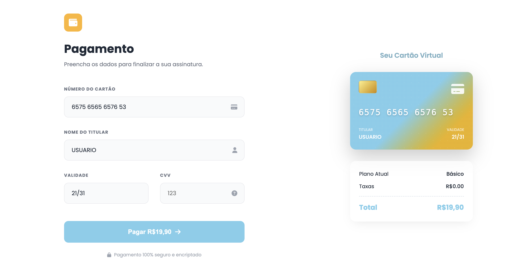

# Página de Pagamento SheeepHub

---

---

### Descrição

A página de Pagamento do projeto SheepHub apresenta um layout que organiza os campos essenciais, como: número do cartão, nome do titular, validade e CVV, em uma estrutura espaçosa e suave, enquanto o painel lΩateral exibe um cartão virtual gerado a partir das informações inseridas, criando uma sensação de transparência e controle. A área de resumo do plano reforça o valor total e mantém o usuário ancorado no propósito da transação.

Essa interface foi desenvolvida especialmente para o TCC SheepHub, integrando clareza visual, responsividade e um toque de modernidade para tornar o processo de pagamento simples, intuitivo e confiável dentro da plataforma.

---
